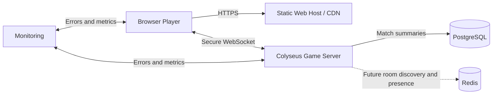
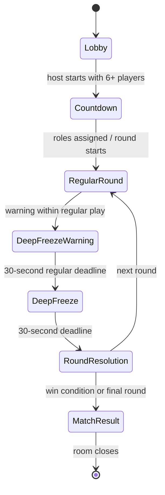
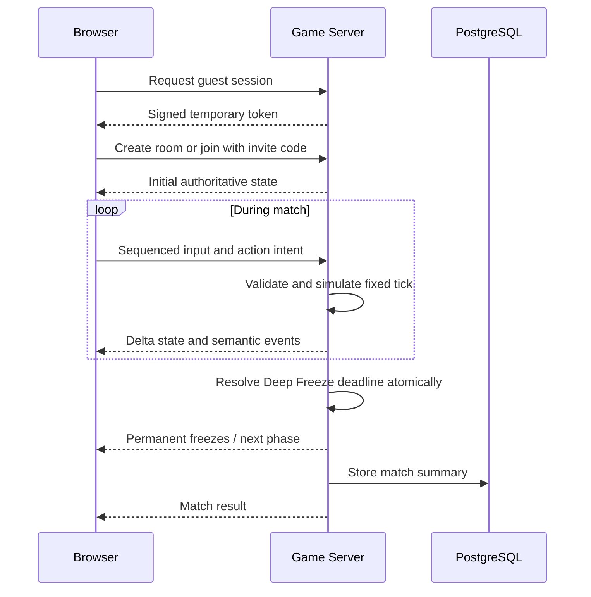

# Ice Ice Water! Architecture

This document is the source of truth for technical structure. Product behavior is defined in `PRD.md`. Architectural changes must update this file and explain the tradeoff.

## Architecture principles

- Browser-native and simple enough for a two-person team
- One authoritative game-server process owns each match
- Clients send intent; the server decides outcomes
- Live match state stays in memory, not in PostgreSQL
- Prefer compact, typed protocol messages and explicit state machines
- Scale by adding independent room processes before adding distributed complexity
- Optimize for graceful degradation on mobile browsers

## High-level system



Static assets and the application bundle can be cached globally. Persistent WebSocket connections terminate at the regional game server.

## Frontend

### Responsibilities

- Render the 3D world through Three.js.
- Render room creation/joining, lobby, HUD, settings, and results through React.
- Capture keyboard and touch intent.
- Predict local presentation and interpolate remote entities.
- Display server-derived timers and outcomes.
- Select graphics quality based on device capability and user preference.
- Reconnect using the temporary guest-session token.
- Use a third-person follow camera with camera-relative movement.

### Boundaries

- The browser never decides whether a tag, rescue, elimination, or win occurred.
- React must not drive per-frame character movement.
- Three.js rendering state may be richer than synchronized gameplay state, but it cannot contradict server outcomes.
- Browser-visible `VITE_` variables are public configuration, never secrets.

### 3D performance strategy

- Low-poly characters use a shared skeleton, animations, materials, and texture atlases.
- Distant players use lower levels of detail and less frequent animation updates.
- Permanently frozen players become static renderers.
- Environment lighting is primarily baked; dynamic shadows and particles scale with quality level.
- Player-to-player physical collision is disabled.

## Backend

### Responsibilities

- Issue and validate temporary guest sessions.
- Create private rooms, issue invite codes, and validate room joins.
- Own the authoritative room state and fixed-step simulation.
- Validate movement, tagging distance, rescue range, cooldowns, and phase eligibility.
- Run round and Deep Freeze deadlines.
- Manage disconnect reservations and reconnection.
- Calculate match results and write summaries.
- Emit structured logs and metrics.

### Room ownership

Each match belongs to exactly one Colyseus room on one Node.js process. Moving an active room between processes is not an MVP requirement. If its process fails, the room ends safely and clients receive a recoverable error.

### Simulation

- Initial target: 20 authoritative ticks per second, measured and adjusted through testing.
- Use simple kinematic movement against static map collision.
- Use a spatial grid or equivalent broad phase for nearby tag and rescue candidates.
- Use squared-distance and line-of-sight checks where required; avoid a general-purpose rigid-body simulation unless profiling proves it necessary.
- Use server timestamps and deadlines for phases, protection windows, cooldowns, and reconnect reservations.
- Configure exactly five rounds for the MVP, each with a 30-second regular deadline followed by a 30-second Deep Freeze deadline.
- Accept rescue intent only during the regular phase; Deep Freeze continues tag simulation but locks rescue.
- Within an authoritative room tick, enqueue development-bot intent first, apply fixed gameplay steps with timestamps strictly before the current phase deadline, and then resolve the phase transition or deadline. The fixed step exactly at a deadline is ineligible; earlier queued steps are not discarded merely because the room callback runs at the deadline.

## Authoritative match state



Required room state includes:

- Room identifier and lifecycle state
- Current round and maximum rounds
- Phase start time and deadline
- Current arena boundary
- Player collection
- Team counts and active/frozen/permanently frozen counts
- Match result and contribution totals

Required player state includes:

- Server-generated player and session identifiers
- Sanitized display name
- Team: Ice or Water
- Position, orientation, and movement sequence
- Connection and reconnect-reservation state
- Active, temporarily frozen, permanently frozen, or spectator state
- Rescue progress target and contributors
- Protection and ability cooldown deadlines
- Contribution counters

## Networking and APIs

### HTTP endpoints

Keep HTTP narrow:

- `GET /health` — process health
- `GET /ready` — dependency and readiness status
- `POST /api/guest-session` — issue or refresh a temporary signed guest session
- `POST /api/rooms` — create a private room and return an invite code
- `POST /api/rooms/join` — validate an invite code and reserve a room seat
- Optional read-only configuration endpoint if build-time configuration is insufficient

Private-room joins, room events, and gameplay use Colyseus messages over secure WebSockets.

### Client-to-server message families

- `input/move` — sequenced movement intent
- `action/tag` — Ice tag attempt
- `action/rescue-start` and `action/rescue-stop` — rescue intent
- `action/help-ping` — rate-limited frozen-player ping
- `session/ready` — readiness during countdown
- `room/start` — host requests the lobby countdown with an empty payload

Rescue messages are valid only during the 30-second regular phase. The server rejects them during Deep Freeze regardless of client presentation.

### Server-to-client events

- `match/phase-changed`
- `player/frozen`
- `player/rescued`
- `player/permanently-frozen`
- `arena/boundary-changed`
- `match/result`
- `session/error`

Continuous synchronized fields should use Colyseus schema state and compact delta patches. One-time semantic changes use typed events. Message names are lowercase `domain/action` strings.

### Update policy

- Nearby active players receive the highest movement-update frequency.
- Distant or occluded players may receive fewer updates.
- Consequential state changes are never omitted by interest management.
- Clients interpolate remote players and reconcile their local predicted presentation with authoritative updates.
- Start with Colyseus serialization; introduce custom binary movement packets only after measurement demonstrates the need.

## Database

PostgreSQL stores durable data only:

- Guest-session metadata when persistence is required
- Match summaries
- Aggregate contribution results
- Operational moderation records introduced within approved scope

PostgreSQL does not store live positions, rescue progress, timers, or per-tick room state.

### Database conventions

- Use UUIDs for durable identifiers.
- Store timestamps in UTC using timezone-aware columns.
- Use migrations for every schema change; never edit production schema manually.
- Use `snake_case` for tables and columns.
- Keep queries behind repository modules in the server application.
- Use transactions when writing a match result and related player results together.
- Do not store raw guest-session signing material.

## Authentication

The MVP uses anonymous guest sessions rather than accounts.

1. The browser submits a sanitized display name over HTTPS.
2. The server creates a random player/session identifier and returns a short-lived signed token.
3. The token is presented when joining or reclaiming a Colyseus room seat.
4. The server validates signature, expiration, room eligibility, and reconnect reservation.

Tokens should be stored only as long as needed for the session. Account registration, passwords, social login, and persistent identity are future product decisions.

## External services

Required for MVP deployment:

- Static web host/CDN
- Regional container or virtual-machine hosting for the game server
- Managed or self-hosted PostgreSQL
- Error and performance monitoring

Not required initially:

- Redis; add only for multi-process discovery, queues, or presence
- Kubernetes or dedicated game-server orchestration
- Third-party identity providers
- Voice, chat, payments, or analytics platforms

## Data flow



## Planned folder and module responsibilities

```text
apps/client/src/
├── game/                   # Three.js scene lifecycle, entities, animation, camera
├── world/                  # Authored terrain, water, routes, landmarks, and boundaries
├── network/                # Colyseus connection, reconciliation, event adapters
├── ui/                     # React lobby, HUD, settings, results
├── input/                  # Keyboard and touch input normalization
├── audio/                  # Music and sound presentation
└── config/                 # Public runtime/build configuration

apps/server/src/
├── auth/                   # Guest-session issuing and validation
├── rooms/                  # Invite codes and Colyseus room lifecycle/handlers
├── simulation/             # Movement and fixed-tick game rules
├── gameplay/               # Freeze, rescue, phases, win conditions
├── persistence/            # PostgreSQL repositories and migrations
├── observability/          # Logs, metrics, error reporting
└── config/                 # Validated private environment configuration

packages/shared/src/
├── protocol/               # Shared message payload and schema types
├── constants/              # Stable cross-boundary constants only
└── validation/             # Pure shared validation where safe

tests/
├── e2e/                    # Critical browser flows
└── load/                   # Simulated clients and load scenarios
```

Client and server must not import directly from one another. Both may depend on `packages/shared`, which must contain no secrets, browser-specific rendering, database access, or server authority logic.

## Important technical decisions

### Three.js instead of PlayCanvas or a Web-exported native engine

The game is browser-only. Three.js keeps the runtime browser-native while exposing the low-level geometry control required by the authored multi-biome island. The prior PlayCanvas prototype was functional, but the approved world brief requires Three.js and stable code-defined terrain, river, bridge, and landmark geometry. Migrating the small prototype renderer was lower risk than maintaining two engines or translating every world module across an adapter. The tradeoff is that scene lifecycle, animation mixing, disposal, and future quality tiers remain explicit application responsibilities.

`MAP_SPEC.md` is the source of truth for physical layout. Pure `X/Z` land masks, route corridors, river exclusions, bridge footprints, spawn generation, and terrain-height sampling live in `packages/shared` so authoritative movement and client prediction agree. The server continues synchronizing only `X/Z`; the client derives `Y` deterministically from the authored surface. Routes do not vertically overlap, so this preserves the existing compact protocol. A future overpass, jump, or airborne mechanic would require adding authoritative `Y` and revisiting distance and line-of-sight rules.

### Colyseus instead of raw WebSockets

Rooms, reconnection, typed state synchronization, and seat reservation are core needs. Colyseus supplies these without requiring the team to invent a networking framework.

### WebSockets for the MVP

The game is not designed as a precision shooter. Secure WebSockets combined with prediction, interpolation, and server validation are sufficient for the first release. A transport change requires evidence from profiling and an architecture update.

### No player-to-player collision

Removing crowd collision improves movement readability, reduces client/server physics cost, and avoids latency-driven pushing disagreements.

### PostgreSQL for durable data; memory for matches

Per-tick data belongs to the room process. PostgreSQL is used only for durable summaries and future durable product data.

### Redis deferred

One regional deployment should begin with the fewest moving parts. Redis is introduced only when multiple processes need shared room discovery or presence.

### Free-tier-first hosting

Initial private playtests should target a free hosting tier. Because free offerings can sleep, cap bandwidth, or limit long-lived WebSockets, the provider must be chosen through a measured hosting spike. The architecture must not depend on a specific free provider until those limits are verified.

## Deployment evolution

### Foundation and private-room implementation (2026-09-10)

- Toolchain: Node 24.18.0 / npm 11.17.0; exact package versions and transitive dependencies are pinned in `package-lock.json`. React/Vite/Three.js, Colyseus core + WebSocket transport + SDK + schema, Express, and node-postgres implement the selected stack. Express supplies the narrow HTTP routes; native HTTP-only routing was considered but would duplicate body parsing and error handling. `pg` uses parameterized SQL and a small migration runner instead of adding an ORM. Development-only tools are TypeScript, tsx, ESLint, Prettier, Vitest, and Playwright.
- Dependency review: current npm metadata was checked for versions, engines, licenses, and compatibility. Runtime packages are MIT licensed (Playwright tooling is Apache-2.0). `npm audit` reported no known vulnerabilities at installation. Three.js and its GLTF loader are code-split from the lobby form so session setup can initialize independently of the renderer; production bundle measurements belong in the verification record. No physics, identity, Redis, or orchestration services were introduced.
- Colyseus 0.18 built-in HTTP matchmaking runs ahead of Express. An HTTP boundary allowlist blocks public create/join/list endpoints, including `joinById`, before dispatch. Initial seat reservations are exclusively issued by the authenticated invite APIs; WebSocket `onAuth` verifies the signed session again. Reconnection remains a capability-based Colyseus endpoint. Origins are checked for HTTP and upgrades; socket payloads are capped at 4 KiB. TLS must terminate at a trusted reverse proxy outside local development, and the raw game port must not be public.
- Sessions use a versioned HMAC-SHA256 envelope with random UUID player/session identifiers, a sanitized name, and expiration. The signature is timing-safe compared; tokens are not logged or persisted in PostgreSQL. Default lifetime is one hour (configurable 60–86,400 seconds), and authenticated refresh retains identity/name. The browser stores tokens per tab in sessionStorage and discards them on name change. No authentication provider or JWT library is needed for this single-issuer opaque token protocol.
- Each process owns its explicit invite-code and membership directory. Eight-character invite codes use cryptographically random characters excluding ambiguous glyphs. One guest session may hold one pending/connected seat at a time. Pending seats expire after 15 seconds; disconnected clients retain their player for a configurable 20–30-second reservation (25 by default). Invite entries are removed on disposal. Multi-process discovery remains deferred.
- HTTP limits per direct peer IP: 600 guest requests/minute, 600 room requests/minute, and 600 upgrades/reconnections/minute; room requests also have a 10/minute session limit. These initial values accommodate a large group behind one NAT and require playtest tuning. Forwarded IP headers are not trusted for HTTP limits. Rooms cap inbound messages at 12/second and start requests at 4/second. The game process does not persist per-IP request data.
- Room capacity defaults to 150 and may be lowered to 6–150 using `ROOM_MAX_PLAYERS`; the start minimum remains six. The server cancels a countdown if fewer than six remain connected, transfers host to the first connected member on departure, and rejects fresh joins once countdown begins. If a creator never consumes the seat, host recovery occurs after the 15-second reservation timeout. The default countdown is five seconds (configurable 1–30).
- At countdown completion, the server shuffles connected players using Node crypto randomness and assigns the approved Ice-count brackets. `ICE_COUNT_BRACKETS` may override the table with complete, increasing thresholds through 150; values must preserve Water at the bottom of each bracket. Roles are retained for the match. A disconnected, unassigned guest cannot enter an already started match through reconnect.
- Active-match drops set a synchronized server-time reconnect deadline without changing team, position, or gameplay status. Movement and rescue intent stop immediately, while the disconnected player remains subject to tags, rescues, phase clocks, and atomic Deep Freeze elimination. A valid reconnect clears only the connection reservation fields. When the reservation expires, the server first advances any due phase deadline, then permanently eliminates an active or frozen participant, retains already eliminated state for match results, releases room membership, and rejects the expired reconnect capability. This ordering prevents a timeout racing the Deep Freeze deadline from bypassing authoritative elimination.
- The first two task groups stop at role assignment and the `regular` phase handoff. The UI explicitly says movement/tagging/rounds are pending. No fake round loop or game outcomes are implemented ahead of MVP-26/28. Warning timing is corrected with user approval: it occurs within the 30-second regular phase, never as extra time between phases.
- PostgreSQL is available through a local Compose service pinned by image digest, with a named volume and loopback-only port. The migration runner uses transactions, an advisory lock, and checksums to reject edited applied migrations. `/health` reports process liveness; `/ready` returns 503 when PostgreSQL is absent/unreachable. Local lobby development can proceed while the database is unavailable; production configuration requires a database URL.
- The schema types live on the server. The safe shared package holds only protocol interfaces, constants, and pure validation. Colyseus `schema()` field builders avoid legacy decorator/class-field compiler incompatibilities.

### Baseline stabilization and development bots (2026-09-11)

- `DEV_BOT_COUNT` enables development-only server-side wandering players for solo match testing. The requested value is validated from zero through `ROOM_MAX_PLAYERS - 1`, while production forces the effective count to zero. Bots reserve seats: human capacity is `ROOM_MAX_PLAYERS - DEV_BOT_COUNT`, and room admission also checks total state population so bots, connected humans, and reconnect-reserved humans cannot exceed the configured maximum of at most 150.
- Bots use normal player state, role assignment, movement validation, phase deadlines, freezing, and elimination. They do not tag, rescue, or become host. This is test tooling rather than a player-facing MVP feature and adds no production bot service or persistent state.
- Playwright always launches its own server and client with `DEV_BOT_COUNT=0`, preventing a developer's root `.env` or an already-running bot-enabled server from changing browser-test population and expectations.
- Authoritative room ticks now apply eligible fixed gameplay steps before match deadline resolution, matching the controller contract. Boundary coverage fixes the semantics: a rescue may complete on the last step strictly before the Regular deadline, queued movement may apply on the last step strictly before the Deep Freeze deadline, and no gameplay step at the deadline itself is accepted.

## Deployment stages

1. **Local:** client, one game server, and PostgreSQL.
2. **MVP playtest:** free-tier static hosting, one regional game-server deployment, and free-tier or local PostgreSQL where verified.
3. **Scale-out:** paid or adequately provisioned hosting, load balancer, multiple room processes, Redis-based discovery/presence, managed PostgreSQL.
4. **Later:** additional regions only when usage and latency measurements justify them.
