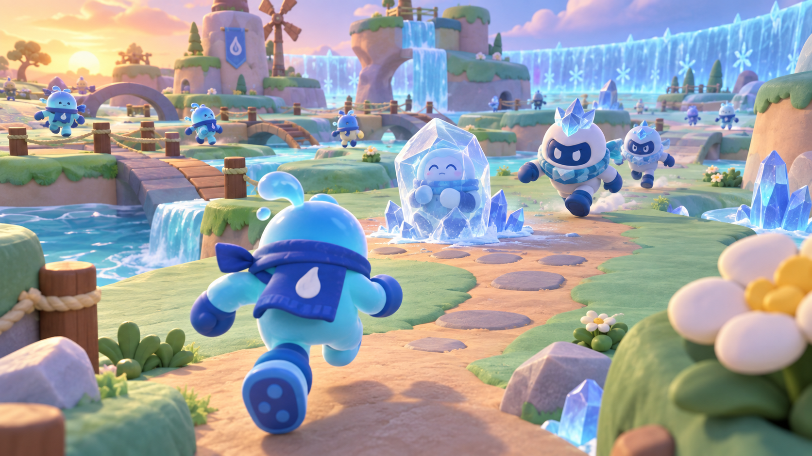

# Ice Ice Water! Art Direction

This document defines the original visual language and asset workflow for Ice Ice Water! It is the visual source of truth for contributors and AI agents.

## Creative direction

The desired feeling is a **cozy toy-diorama world interrupted by a playful winter emergency**. The reference to Pokopia means broad qualities visible on its official site—charming, approachable characters; rounded forms; layered natural spaces; soft color; and a welcoming handcrafted atmosphere—not its protected characters or specific designs. The game must establish its own identity. [Official Pokopia reference](https://pokopia.pokemon.com/)

### Visual pillars

1. **Soft and toy-like:** Rounded silhouettes, chunky readable proportions, and surfaces resembling painted clay, soft vinyl, or carved foam.
2. **Cozy versus cold:** Warm mint grass, coral flowers, and honey sunlight contrast with cyan ice, indigo shadows, and crystalline Deep Freeze effects.
3. **Readable in a crowd:** Ice, active Water, protected Water, temporarily frozen, and permanently frozen players remain distinguishable when many characters share the screen.
4. **Third-person clarity:** The environment is composed for a camera behind and above the avatar, with clear paths, low visual barriers, and landmarks readable from a distance.
5. **Browser-efficient charm:** Strong silhouettes and color blocking carry the look instead of high polygon counts, complex shaders, or dense textures.

## Original identity

- Do not use Pokémon, Pokopia, Nintendo, or other third-party names in player-facing content.
- Do not copy recognizable creature silhouettes, faces, costumes, props, architecture, logos, UI, music, or layouts.
- Use broad inspiration only: cozy stylization, toy-scale materials, terraced natural environments, and expressive animation.
- Player characters should be original rounded travelers with mitten-like hands, simple faces, scarf or droplet motifs, and highly readable team treatments.

## Camera and composition

- Third-person follow camera, approximately three-quarter rear view
- Slightly elevated angle so nearby players and rescue targets remain visible
- Camera-relative movement
- Adjustable sensitivity and optional camera recenter
- Avoid tall foreground props that regularly occlude the avatar
- Use landmark silhouettes and colored zones for navigation

## Shape language

### Water team

- Rounded teardrops, bubbles, ripples, arcs, and soft asymmetry
- Friendly upright silhouettes with wide feet and simple hands
- Flexible scarf accent for motion readability

### Ice team

- Rounded base silhouette interrupted by crystalline corners
- Frost crown, shard collar, or angular backpack-like accent
- Frost is hand-cast as a compact glowing shard with a soft cyan halo; avoid aggressive weapons or firearm language

### Environment

- Terraced grassy islands with softened block edges
- Pebble paths, shallow channels, bridges, rounded trees, and oversized flowers
- Ice advances as faceted translucent growth and powdery frost rather than horror imagery
- Arena boundaries should read as a moving weather wall, not an invisible barrier

## Color system

| Purpose | Direction | Example range |
|---|---|---|
| Water team | Aqua, sky blue, turquoise | `#48CFE3`, `#5EA8FF`, `#38D6B3` |
| Ice team | Deep indigo, electric cyan, violet | `#4056D8`, `#7EEBFF`, `#805AD5` |
| Protection | Warm gold plus a bubble rim | `#FFD66B` |
| Temporary freeze | Pale cyan with visible trapped silhouette | `#BDEFFF` |
| Permanent freeze | Desaturated blue-white with darker crystalline base | `#D8F5FF`, `#699BC8` |
| Safe environment | Mint, leaf green, coral, cream | `#79D49A`, `#BCEB8B`, `#FF8D7A`, `#FFF1D1` |
| Deep Freeze | Cyan fog, indigo shadow, white frost | `#9BEAFF`, `#293875`, `#F7FCFF` |

Color must not be the only state signal. Pair it with silhouette changes, icons, particles, sound, and animation.

## Materials and rendering

- Use simple PBR materials with restrained texture detail.
- Favor baked lighting and a single primary directional light.
- Keep roughness high for clay and painted surfaces.
- Use selective translucency only for ice shells and effects; provide a cheaper opaque fallback.
- Use soft blob shadows on low settings and limited real-time shadows on higher settings.
- Use fog and particles sparingly, with a reduced-effects accessibility option.
- Author reusable atlases and shared materials to control draw calls.

## Animation language

- Slightly bouncy locomotion with quick anticipation and recovery
- Clear freeze pose readable without close inspection
- Rescue animation uses a warm expanding ripple during regular play
- Deep Freeze start uses a shared environmental pulse and character shiver
- Permanent freeze resolves with clean crystallization, not graphic shattering
- Distant characters use throttled or simplified animation

## UI direction

- Rounded panels with thick, clean borders
- The pre-match lobby is an immersive third-person clubhouse hub: the avatar stage remains visible between a left rules/roster board, a right private-room board, one central primary action, and a compact match-format dock.
- Lobby boards may use clipped ice-facet corners, slim glowing edges, and dark translucent surfaces for depth. Keep the surrounding 3D forms soft and toy-like so the result feels like this world rather than a military or sci-fi shooter interface.
- Third-party lobby references may inform broad spatial rhythm only. Do not copy their branding, wording, icons, progression systems, characters, weapons, or exact interface graphics.
- Large phase timer and unmistakable phase label
- Water-drop and snowflake icons supplement team colors
- Invite codes use large characters, generous spacing, and copy feedback
- During Deep Freeze, rescue controls visibly lock and show “RESCUE LOCKED”
- Mobile controls remain translucent and avoid covering the center action
- Desktop play uses a small lower-left “ice ticket” control guide with tactile keycap shapes; role-specific rows appear only when relevant.
- Active Ice players receive a restrained snowflake reticle at screen center. It should aid aim without obscuring nearby players or looking like a firearm sight.

## Asset sourcing

Prototype with verified, permissively licensed assets, then customize or replace them so the final game has a coherent identity.

Candidate sources:

- [Kenney assets](https://kenney.nl/assets) for prototype environment pieces, input prompts, and UI. Kenney states that asset-page game assets are CC0; verify the included license for every downloaded pack. [Kenney license guidance](https://kenney.nl/support)
- [Quaternius Stylized Nature MegaKit](https://quaternius.com/packs/stylizednature.html) for prototype nature objects. Its official page identifies the pack as CC0 and suitable for commercial projects.

For every imported asset, record:

- Asset name and version or download date
- Original author and canonical source URL
- License and a local copy of its license text when supplied
- Any attribution requirement
- Modifications made
- Where the asset is used

Do not use search-result copies, ripped game assets, or an asset whose original license cannot be verified.

## Generation policy

Generate assets only when a suitable licensed source is unavailable or when an original identity is important. Before generation:

1. Define the asset's gameplay purpose and viewing distance.
2. Write a structured prompt with composition, palette, material, and technical constraints.
3. Explicitly exclude copyrighted characters, logos, text, and watermarks.
4. Generate a concept reference before production-ready sprites or textures.
5. Review the result for originality, readability, and consistency.
6. Keep the final prompt beside or referenced by the accepted asset.

Generated concept art is a direction reference, not a ready-to-ship 3D model. Production geometry should be created or adapted in Blender and optimized for GLB export.

## First visual-direction prompt

Generated reference: [Ice Ice Water! visual direction v1](assets/concepts/ice-ice-water-visual-direction-v1.png)



Status: **Awaiting approval from Chad Bojelador and Franco Perez.** This image sets mood, camera, palette, character readability, and material direction; it is not final key art or a source of production-ready models.

```text
Use case: stylized-concept
Asset type: pre-production key art and visual-direction reference for a browser-based 3D multiplayer game
Primary request: Create an original third-person gameplay scene for “Ice Ice Water!”, a playful large-crowd freeze-tag game. Show a Water-team character running toward a temporarily frozen teammate during the rescuable regular phase, while two Ice-team chasers approach and a distant circular frost wall hints at the coming Deep Freeze.
Scene/backdrop: A compact toy-diorama island playground with softly terraced mint grass, shallow turquoise water channels, rounded bridges, pebble paths, oversized flowers, soft trees, and small crystalline ice patches. Preserve broad open lanes suitable for many players.
Subject: Original rounded traveler characters with mitten-like hands, simple expressive faces, wide feet, and scarf or droplet motifs. Water characters use curved bubble shapes; Ice characters add distinct but friendly crystalline accents. No weapons.
Style/medium: Polished original stylized 3D game concept render; cozy, chunky, soft-vinyl and painted-clay materials; simple shapes and strong silhouettes suitable for low-poly browser production.
Composition/framing: 16:9 third-person camera slightly above and behind the main Water character, with the rescue target in the middle ground, Ice chasers readable behind it, and a clear view of traversable arena paths. Include a small background crowd without clutter.
Lighting/mood: Warm late-afternoon sunlight over the safe area contrasted with cool cyan light from the approaching frost wall; playful urgency, friendly rather than threatening.
Color palette: Mint green, aqua, sky blue, coral, lavender, cream, electric cyan, and deep indigo accents.
Materials/textures: Matte clay terrain, soft painted wood, smooth vinyl characters, selective frosted-glass ice, minimal texture noise.
Constraints: Original world and character design; readable team silhouettes; environment must look achievable as optimized browser 3D; no UI overlay; no text; no watermark.
Avoid: Pokémon, Pokopia characters, recognizable third-party creatures, copied costumes or props, franchise logos, photorealism, anime line art, combat weapons, visual clutter, dense foliage, high-frequency textures, dark horror tone.
```

## Approval checklist

Before treating a visual reference or asset as approved, confirm:

- It is original or has a verified usable license.
- It does not resemble a protected character or franchise-specific design.
- Team and gameplay states remain readable without color alone.
- It fits the third-person camera and 150-player performance constraints.
- A lower-quality mobile fallback is possible.
- Chad Bojelador and Franco Perez have approved the direction.
